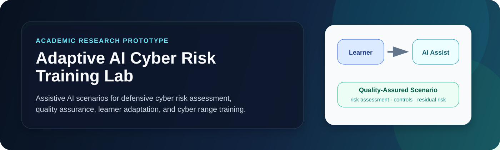
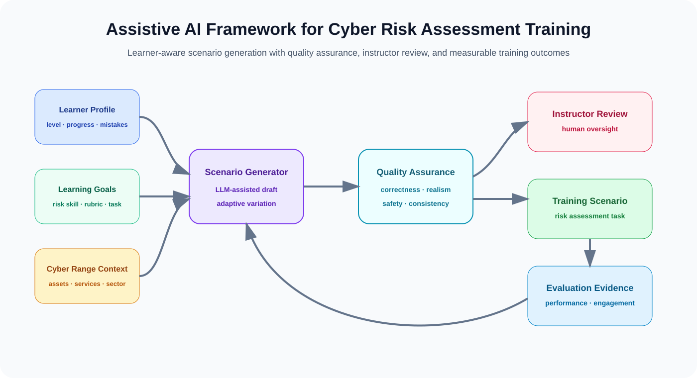
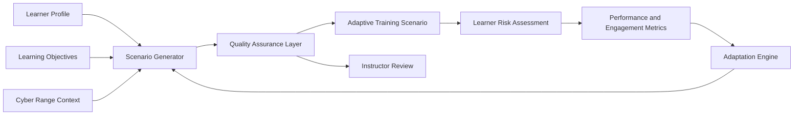
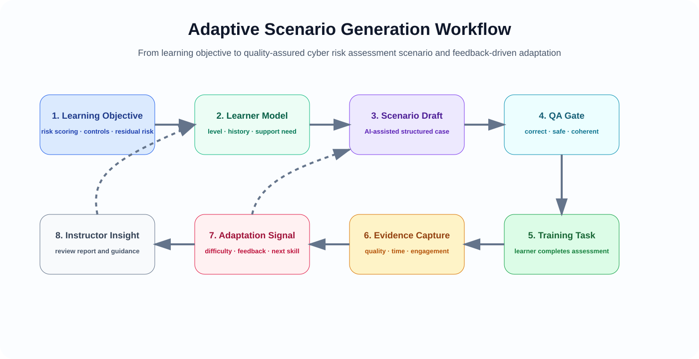
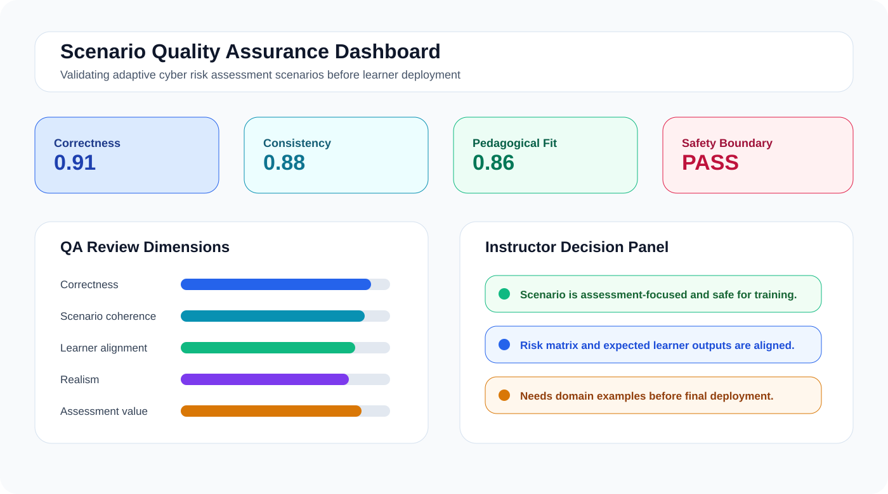

<p align="center">
  
</p>

<h1 align="center">Adaptive AI Cyber Risk Training Lab</h1>

<p align="center">
  <b>Assistive AI-based adaptive scenarios for cyber risk assessment training in cyber range environments.</b>
</p>

<p align="center">
  
  
  
  
  
</p>

---

## Overview

**Adaptive AI Cyber Risk Training Lab** investigates how assistive artificial intelligence can improve the teaching and practice of **cyber risk assessment**. The project focuses on adaptive scenario generation using Large Language Models in cyber range learning environments, with an emphasis on realism, consistency, pedagogical value, and learner-centred progression.

The goal is not to automate offensive cyber activity. The goal is to support safe, structured, and educational cyber risk assessment training where learners identify assets, threats, vulnerabilities, likelihood, impact, controls, residual risk, and decision priorities.

---

## Research Motivation

Cyber risk assessment is a vital organisational skill, but many training activities still rely on static case studies. Static cases are difficult to customise, slow to update, and often limited in their ability to reflect realistic organisational complexity.

This project asks:

> **Can assistive AI-generated adaptive scenarios improve cyber risk assessment learning, engagement, and skill transfer compared with traditional static case-study training?**

---

## Research Objectives

| Objective | Description |
|---|---|
| Design an assistive AI framework | Generate adaptive cyber risk assessment scenarios for cyber range training. |
| Build quality assurance checks | Validate correctness, consistency, realism, safety, and pedagogical value. |
| Compare training approaches | Compare adaptive AI-generated scenarios with traditional case-study training. |
| Identify effective scenario features | Study which scenario characteristics support learning and skill development. |
| Produce design guidance | Provide practical guidelines for trustworthy AI-supported cyber security education. |

---

## Proposed Framework

<p align="center">
  
</p>



The framework separates AI assistance from instructional control. AI proposes scenario variants, while a quality assurance layer checks each scenario before use.

---

## Adaptive Scenario Workflow

<p align="center">
  
</p>

| Scenario component | Role in training |
|---|---|
| Organisational context | Defines sector, assets, services, users, dependencies, and business constraints. |
| Risk assessment task | Asks learners to assess likelihood, impact, controls, and residual risk. |
| Adaptation signal | Uses learner level, previous mistakes, and target skill to tune complexity. |
| Quality assurance evidence | Checks realism, coherence, safety boundary, rubric alignment, and consistency. |
| Instructor review | Allows expert oversight before scenario deployment. |

---

## Quality Assurance Mechanism

<p align="center">
  
</p>

| QA dimension | What it checks |
|---|---|
| Correctness | Plausible assets, controls, threats, likelihood, and impact relationships. |
| Consistency | Scenario facts, learner task, risk matrix, and expected answer do not contradict. |
| Pedagogical alignment | Scenario matches learner level and learning objective. |
| Realism | Context resembles a credible organisational cyber risk situation. |
| Safety boundary | Scenario avoids operational misuse details and remains assessment-focused. |
| Assessment value | Scenario supports measurable learning outcomes and skill development. |

---

## Evaluation Methodology

| Condition | Description | Evidence collected |
|---|---|---|
| Traditional case study | Learners complete a fixed cyber risk assessment case. | Baseline accuracy, time, confidence, engagement. |
| Adaptive AI scenario | Learners receive scenario variants adapted to level and progress. | Assessment quality, engagement, skill transfer, learner feedback. |
| Instructor-reviewed AI scenario | AI-generated scenario is checked through QA and instructor review. | Trustworthiness, usability, instructional fit. |

Potential dependent variables include risk identification accuracy, likelihood-impact reasoning, control selection quality, residual risk justification, learner engagement, perceived realism, and transfer to unseen scenarios.

---

## Quick Start

```bash
git clone https://github.com/Hirakhyzer/adaptive-ai-cyber-risk-training.git
cd adaptive-ai-cyber-risk-training
python -m venv .venv
source .venv/bin/activate  # Windows: .venv\Scripts\activate
python -m pip install --upgrade pip
python -m pip install -r requirements.txt
python examples/run_scenario_quality_audit.py
pytest
```

---

## Repository Structure

```text
adaptive-ai-cyber-risk-training/
├── assets/
│   ├── banner.svg
│   ├── system-architecture.svg
│   ├── adaptive-scenario-workflow.svg
│   └── quality-assurance-dashboard.svg
├── data/
│   └── scenario_templates.json
├── docs/
│   ├── framework.md
│   ├── evaluation-methodology.md
│   ├── ethical-boundary.md
│   └── scenario-quality-rubric.md
├── examples/
│   └── run_scenario_quality_audit.py
├── src/adaptive_cyber_risk_training/
│   ├── schema.py
│   ├── scenario_generator.py
│   ├── quality_assurance.py
│   └── evaluation.py
└── tests/
    └── test_quality_assurance.py
```

---

## Responsible AI Boundary

This repository is for defensive education, cyber risk assessment training, and responsible AI research. It does not provide exploit procedures, malware logic, credential abuse, evasion guidance, or offensive operational steps. Scenario content should remain focused on organisational risk reasoning, control selection, evidence quality, and learner development.

---

## Expected Contributions

- A structured framework for AI-supported adaptive cyber risk assessment training.
- A reusable scenario representation for cyber range learning contexts.
- A quality assurance rubric for AI-generated cyber risk scenarios.
- Evaluation measures for learning performance, engagement, and skill transfer.
- Responsible design guidance for scalable and trustworthy AI-supported cyber security education.

---

## License

Released under the [MIT License](LICENSE).

---

## Author

Created by **Hira Khyzer** as an academic research prototype on assistive AI, cyber range training, and adaptive cyber risk assessment education.
